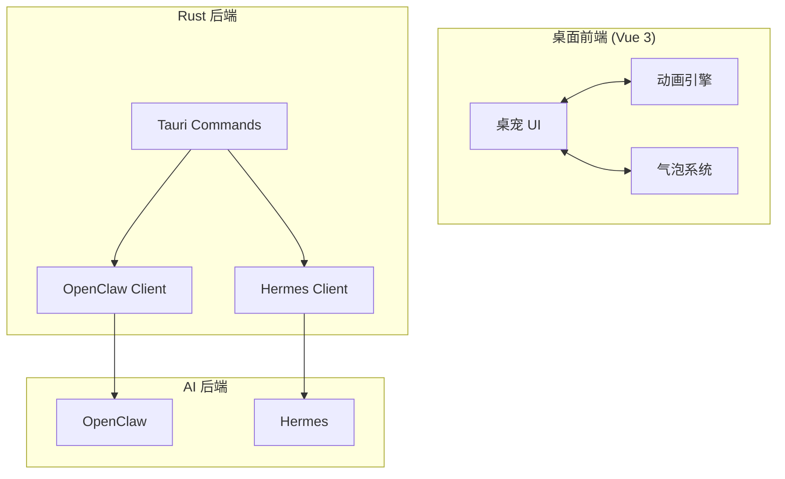

# 桌宠助手 - 最简版 PRD

## 1. 产品定位

**桌面智能宠物助手**：基于 Tauri v2 的跨平台桌宠应用，通过拟人化宠物提供 AI 对话和文件处理功能。

## 2. 系统架构

## 3. 产品模块

| 模块 | 功能 |
|------|------|
| **桌宠 UI** | 180x180 像素精灵图动画窗口 |
| **对话模块** | 双击输入、拖拽文件、发送消息 |
| **气泡模块** | 工具调用气泡、响应结果气泡 |
| **设置模块** | 缩放比例、响应音效 |
| **右键菜单** | 状态切换、OpenClaw 命令 |

## 4. 核心功能

### 4.1 动画状态

| 状态 | 触发 |
|------|------|
| `idle` | 默认待机 |
| `shock` | 右键菜单 Shock |
| `EnterInput` | 双击桌宠 |
| `startworking` → `working` | 发送消息后 |
| `EnterReceiving` → `received` | 拖入文件 |
| `Response` | 收到 AI 响应 |

### 4.2 用户交互

| 操作 | 功能 |
|------|------|
| 双击 | 弹出输入框 |
| 右键菜单 | 状态切换、命令 |
| 拖拽文件 | 发送给 AI |
| 点击文件 | 打开文件 |
| 长按拖动 | 移动位置 |

### 4.3 AI 后端支持

- **OpenClaw**: WebSocket 通信
- **Hermes**: HTTP + SSE 通信
- **自动路由**: 根据配置选择后端

## 5. 版本规划

| 版本 | 功能 |
|------|------|
| v0.1 | 基础桌宠 UI、动画系统、右键菜单 |
| v0.2 | OpenClaw/Hermes 双后端支持、工具气泡 |
| v1.0 | 文件处理、响应气泡、设置面板 |
| v1.1 | 右键菜单完善、多后端自动发现 |
