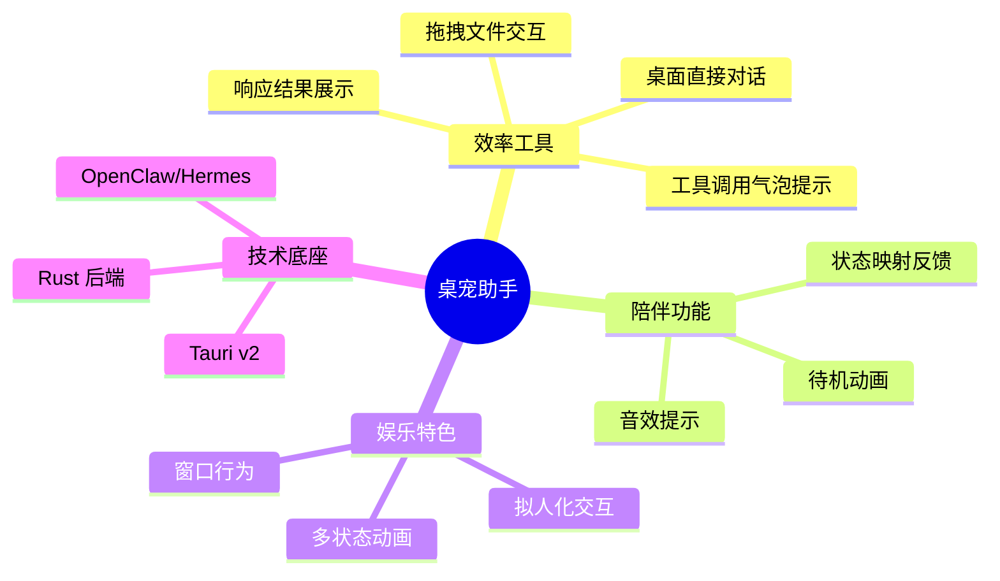
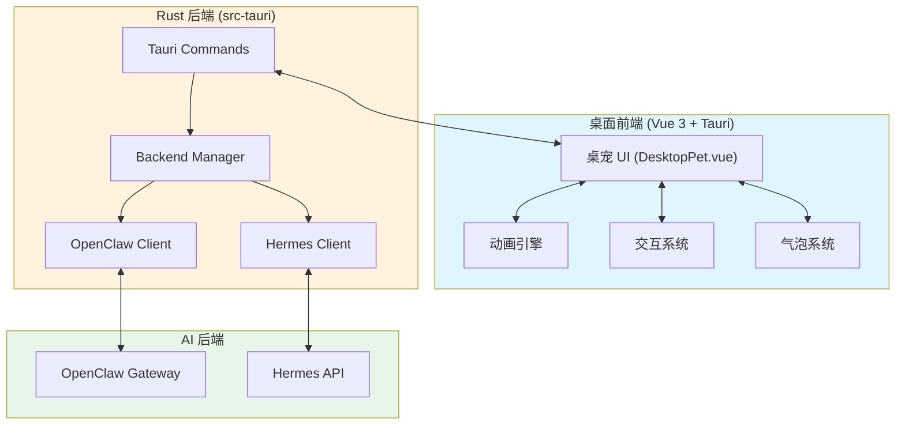
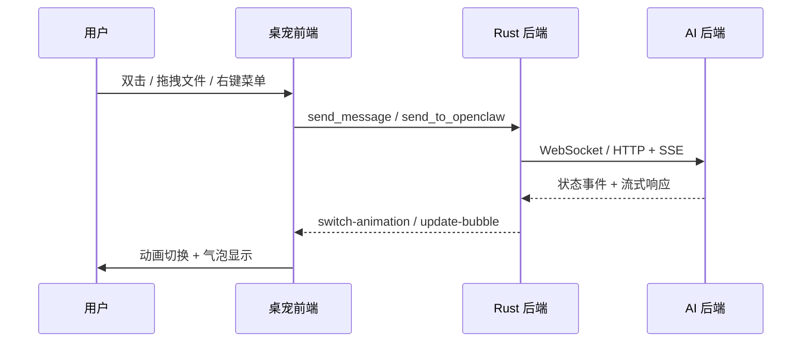
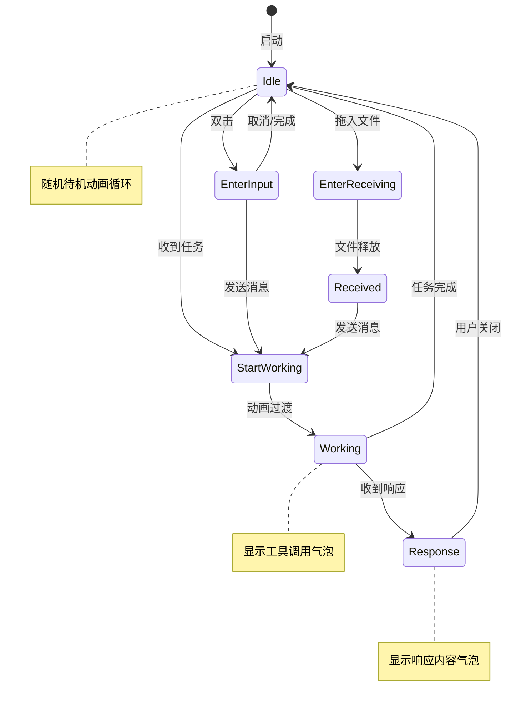
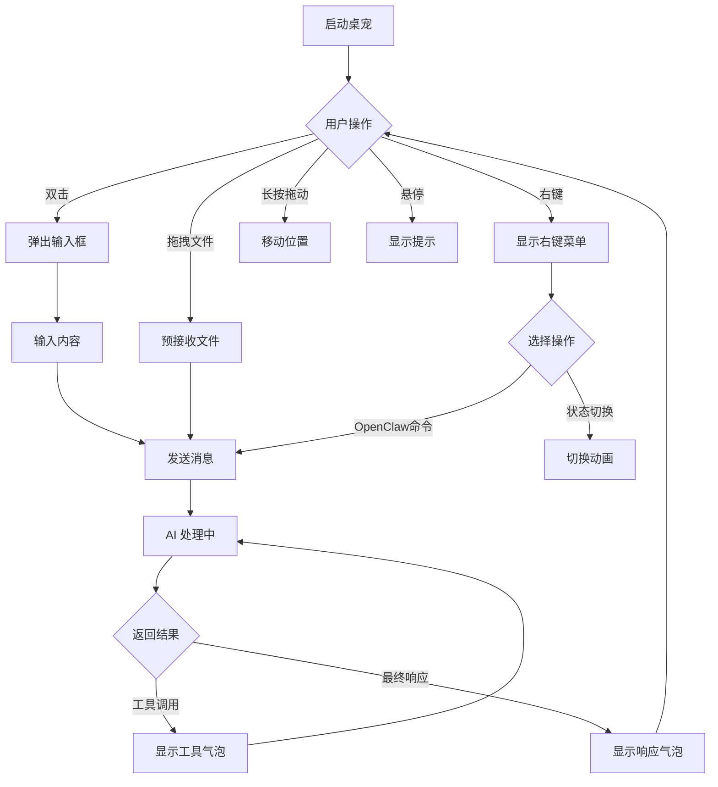
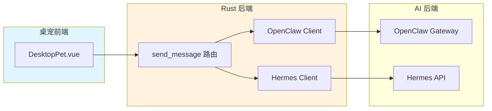
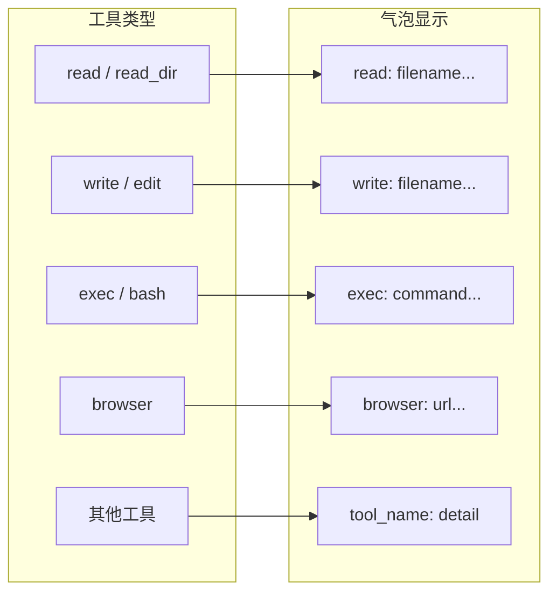

# 桌宠助手 - 产品需求文档 (PRD)

> **版本**: v0.2
> **作者**: 产品团队
> **更新日期**: 2026-04-23

---

## 1. 产品概述

### 1.1 产品定位

**桌面智能宠物助手**：基于 Tauri v2 构建的跨平台桌宠应用，融合效率工具 + 陪伴 + 娱乐三大核心价值。

区别于纯娱乐桌宠与纯严肃效率工具，通过拟人化的宠物形象提供 AI 对话、文件处理、状态反馈等实用功能。

### 1.2 产品全景图



---

## 2. 系统架构

### 2.1 整体架构图



### 2.2 技术栈

| 层级 | 技术 | 说明 |
|------|------|------|
| 前端框架 | Vue 3 + TypeScript | 组合式 API |
| 桌面框架 | Tauri v2 | 跨平台桌面应用 |
| 后端语言 | Rust | 高性能后端 |
| AI 后端 | OpenClaw / Hermes | 双后端支持 |
| 通信方式 | WebSocket + HTTP/SSE | 实时通信 |

### 2.3 数据流向



---

## 3. 功能需求

### 3.1 桌宠行为体系

#### 3.1.1 动画状态层

基于精灵图的帧动画系统，支持以下状态：

| 状态 | 精灵图 | 描述 | 触发条件 |
|------|--------|------|----------|
| `idle` | ildesanimation.png | 待机循环动画 | 默认状态、无任务时 |
| `shock` | shock.png | 惊讶动画 | 右键菜单 Shock |
| `EnterInput` | talkmode.png | 进入输入模式 | 双击桌宠 |
| `startworking` | startworking.png | 开始工作 | 收到任务开始 |
| `working` | startworking.png |工作中循环 | 任务处理中 |
| `workingPreview` | startworking.png | 工作预览 | 预览模式 |
| `EnterReceiving` | receiving.png | 进入接收文件 | 文件拖入 |
| `Receiving` | receiving.png | 接收文件循环 | 持续拖入状态 |
| `received` | received.png | 文件已接收 | 文件拖入完成 |
| `Response` | ildesanimation.png | 显示响应 | AI 返回结果 |

#### 3.1.2 窗口行为

| 行为 | 说明 |
|------|------|
| 边缘隐藏 | 桌宠自动贴边隐藏 |
| 边缘窥视 | 鼠标靠近时从边缘探出 |
| 拖拽移动 | 长按拖动改变位置 |

#### 3.1.3 桌宠状态机



### 3.2 交互设计

| 操作 | 功能描述 |
|------|----------|
| **双击** | 弹出输入框，开始对话 |
| **右键菜单** | 显示状态切换/OpenClaw 命令/创建分身 |
| **长按拖动** | 移动桌宠位置 |
| **拖入文件** | 预接收后发送给 AI 处理 |
| **悬停** | 显示工具提示信息 |
| **点击文件** | 打开宠物手中的文件 |

#### 3.2.1 右键菜单功能

| 菜单项 | 功能 |
|--------|------|
| Shock | 触发惊讶动画，发送消息 |
| Start working | 切换到开始工作动画 |
| Working | 切换到工作中动画 |
| Working Preview | 切换到工作预览动画 |
| Enter Receiving | 切换到接收文件动画 |
| Receiving | 切换到持续接收动画 |
| Response | 切换到响应显示动画 |
| 创建分身 | (占位) 创建多个宠物实例 |
| Commands 子菜单 | /new, /stop, /status |

#### 3.2.2 用户交互流程



### 3.3 核心功能

#### 3.3.1 对话功能

- **文字输入**: 双击桌宠弹出输入框，发送消息
- **流式响应**: AI 返回结果实时显示在气泡中
- **多后端支持**: 自动路由到 OpenClaw 或 Hermes

#### 3.3.2 文件处理

- **拖拽上传**: 将文件拖入桌宠窗口
- **文件图标**: 根据文件类型显示不同图标
- **点击打开**: 点击文件图标打开对应应用
- **多文件支持**: 同时处理多个文件

#### 3.3.3 气泡系统

| 气泡类型 | 说明 |
|----------|------|
| **工具气泡** | 显示当前工具调用 (read/write/exec/browser 等) |
| **响应气泡** | 显示 AI 完整响应内容 |
| **队列气泡** | 显示待处理任务 |

工具气泡内容示例:
- `read: filename...`
- `write: settings.json`
- `exec: npm install...`
- `browser: github.com/...`

#### 3.3.4 设置功能

| 设置项 | 说明 | 范围 |
|--------|------|------|
| 宠物缩放 | 调整桌宠大小 | 0.5x ~ 2x |
| 响应音效 | 收到响应时播放提示音 | Off / Chime / Soft / Notification / Classic / Crisp |

---

## 4. 与 AI 后端的集成

### 4.1 双后端架构



### 4.2 后端自动发现

**Hermes 发现机制**:
- 检查配置文件 `~/.config/meo-claw/hermes.json`
- 环境变量 `HERMES_API_KEY`
- 默认端点 `http://127.0.0.1:8642`

**OpenClaw 发现机制**:
- Gateway 地址和端口配置
- WebSocket 连接认证

### 4.3 生命周期状态映射

| OpenClaw/Hermes 状态 | 桌宠动画 |
|----------------------|----------|
| 空闲 | idle |
| 开始处理 | startworking → working |
| 工具调用 | working + 工具气泡 |
| 流式响应 | working (持续) |
| 最终响应 | Response + 响应气泡 |
| 错误 | 显示错误提示 |

### 4.4 工具调用气泡



---

## 5. 性能要求

| 指标 | 目标值 |
|------|--------|
| 启动时间 | < 3 秒 |
| 内存占用 | < 150MB |
| CPU 空闲占用 | < 5% |
| WebSocket 延迟 | < 100ms |

---

## 6. 兼容性

| 平台 | 支持版本 |
|------|----------|
| macOS | macOS 11+ |
| Windows | Windows 10+ |
| Linux | Ubuntu 20.04+ |

---

## 7. 文件结构

```
MeoClaw/
├── src/                          # Vue 前端
│   ├── components/
│   │   ├── DesktopPet.vue        # 桌宠主组件
│   │   └── FileDropOverlay.vue   # 文件拖放覆盖层
│   ├── config/
│   │   ├── animations.ts         # 动画配置
│   │   └── fileIcons.ts          # 文件图标配置
│   ├── menu/
│   │   └── contextMenu.ts       # 右键菜单
│   ├── stores/
│   │   └── petSettings.ts       # 设置状态管理
│   ├── config/
│   │   └── windowBehavior.ts    # 窗口行为
│   └── main.ts
│
├── src-tauri/src/                # Rust 后端
│   ├── lib.rs                    # 主入口和命令
│   ├── main.rs                   # Tauri 入口
│   ├── backend/
│   │   ├── mod.rs
│   │   ├── client_trait.rs      # 客户端接口
│   │   ├── hermes_client.rs      # Hermes 适配器
│   │   ├── hermes_discovery.rs   # Hermes 发现
│   │   ├── manager.rs            # 后端管理
│   │   └── openclaw_client.rs    # OpenClaw 适配器
│   └── openclaw/
│       ├── mod.rs
│       ├── auth.rs               # 认证
│       ├── client.rs             # WebSocket 客户端
│       └── protocol.rs           # 协议定义
│
└── public/
    └── anim/                      # 动画精灵图资源
```

---

## 8. 附录

### 8.1 动画精灵图

| 动画 | 路径 | 帧数 | 尺寸 |
|------|------|------|------|
| idle | /anim/ildesanimation.png | 16 (4x4) | 4 列 4 行 |
| shock | /anim/shock.png | 10 (3x4) | 3 列 4 行 |
| EnterInput | /anim/talkmode.png | 3 (3x1) | 3 列 1 行 |
| startworking | /anim/startworking.png | 48 (7x7) | 7 列 7 行 |
| receiving | /anim/receiving.png | 12 (4x3) | 4 列 3 行 |
| received | /anim/received.png | 1 | 单帧静态 |

### 8.2 音效资源

| 音效 | 文件 | 说明 |
|------|------|------|
| Off | - | 禁用音效 |
| Chime | /sound/response/chime.mp3 | 清脆提示音 |
| Soft | /sound/response/soft.mp3 | 柔和提示音 |
| Notification | /sound/response/notification.ogg | 通知音 |
| Classic | /sound/response/classic.wav | 经典音效 |
| Crisp | /sound/response/crisp.wav | 清脆音效 |
