# 桌宠贴边半隐藏功能设计草案（2026-04-17）

## 这份文档解决什么问题

这份草案不是实现记录，而是给功能定规则。

目标是把“桌宠拖到桌面左右边缘后，半藏进去，鼠标靠近再探出来，隐藏时还能提醒有新消息”这件事讲清楚，避免后面动画、窗口逻辑、交互逻辑互相打架。

---

## 一句话理解

桌宠以后有两套并行状态：

- `动画状态`：猫现在在做什么，比如 `idle / working / Response`
- `窗口行为状态`：猫现在怎么停靠，比如 `normal / dragging / edgeHiddenLeft`

这两套状态是正交的，可以同时存在。

例如：

- `idle + normal`
- `working + edgeHiddenRight`
- `Response + edgePeekLeft`

---

## 为什么要拆成两套状态

如果把“被拖动”“贴边半隐藏”“探出一点”“有未读提醒”都塞进动画状态机，会很快变成下面这种混乱组合：

- `idleHiddenLeft`
- `workingHiddenRight`
- `responsePeekLeft`
- `enterInputDragging`

这样状态数量会爆炸，后续很难维护。

所以这里建议：

- 动画状态继续由现有 `AnimState` 管
- 新增一套独立的 `WindowBehaviorState`

---

## 总体结构图

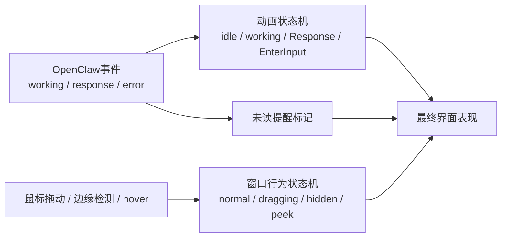

---

## 功能目标

第一版目标：

- 任何动画状态下都能被拖动
- 拖到左右边缘后可半隐藏
- 鼠标移到露出的边缘时，桌宠自动探出一点
- 半隐藏期间如果有新消息，桌宠仍然能提醒用户
- 不影响现在已有的 `working / Response / 输入框 / 缩放` 体系

第一版明确不做：

- 不做上下边缘隐藏
- 不做“完全消失，只留 invisible 热区”
- 不做复杂物理动画
- 不做隐藏状态下完整展示 Response 大气泡

---

## 核心状态定义

### 1. 动画状态

沿用现有状态：

- `idle`
- `EnterInput`
- `EnterReceiving`
- `Receiving`
- `received`
- `working`
- `workingPreview`
- `Response`
- `shock`

### 2. 窗口行为状态

新增建议：

- `normal`
  - 正常显示，完全展开
- `dragging`
  - 用户正在拖动桌宠
- `edgeHiddenLeft`
  - 吸附在左边缘，半隐藏
- `edgeHiddenRight`
  - 吸附在右边缘，半隐藏
- `edgePeekLeft`
  - 左侧半隐藏后，鼠标靠近，探出一点
- `edgePeekRight`
  - 右侧半隐藏后，鼠标靠近，探出一点

### 3. 附加标记

不是独立状态，而是附加字段：

- `hasUnreadActivity: boolean`
- `activityLevel: none | working | response | error`

它表示“隐藏期间有没有值得提醒的内容”。

---

## 状态机总览图

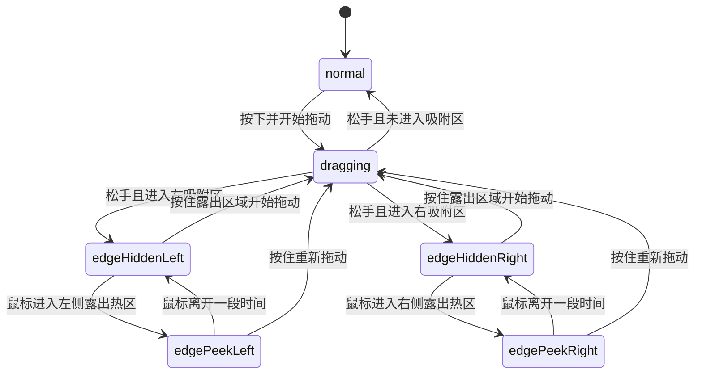

---

## 拖动与吸附流程

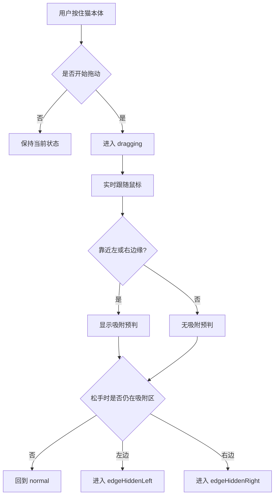

---

## 鼠标 hover 探出流程

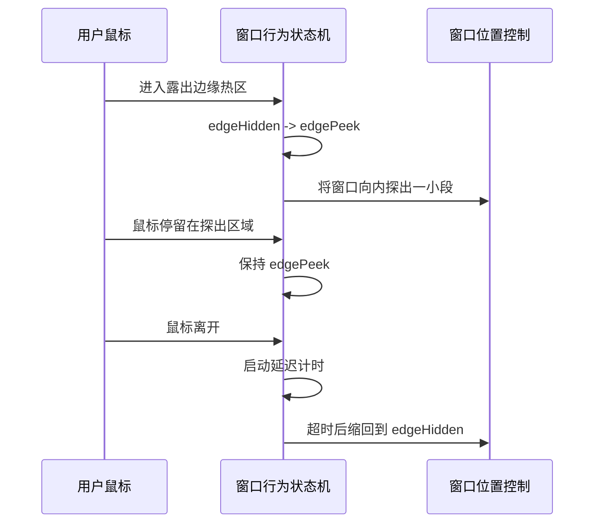

---

## 新消息提醒流程

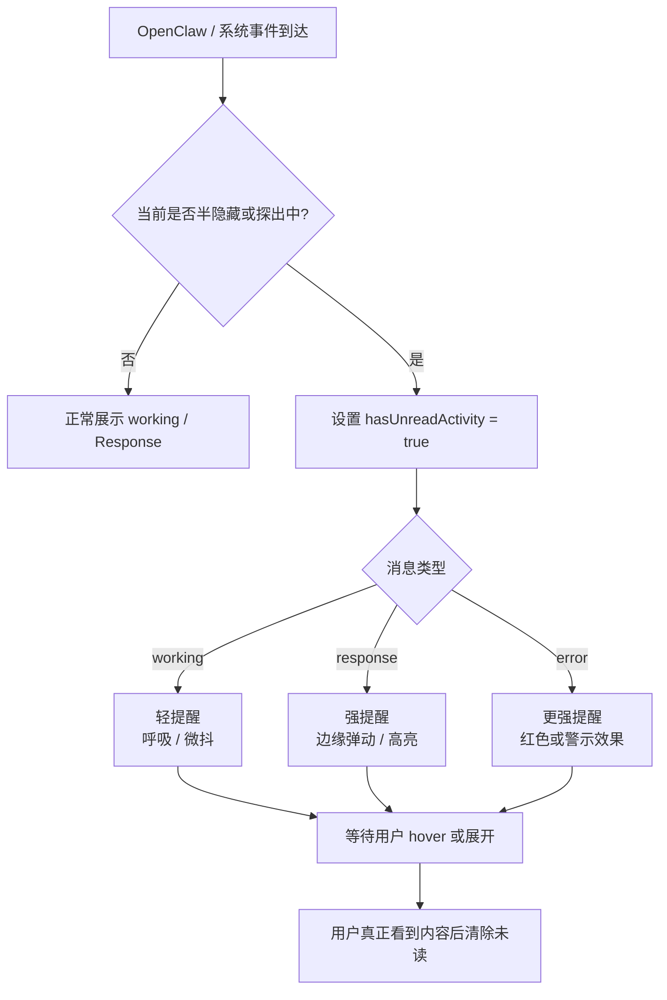

---

## 视觉表现图

### 正常状态

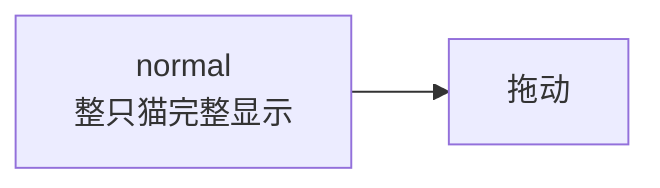

### 左侧半隐藏

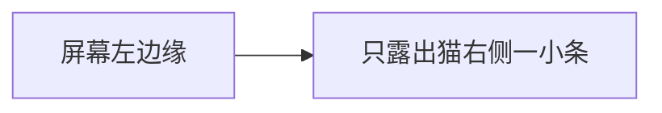

### 右侧半隐藏

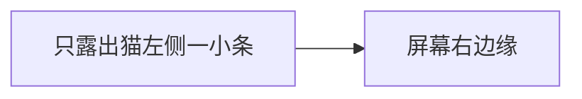

### 探出一点

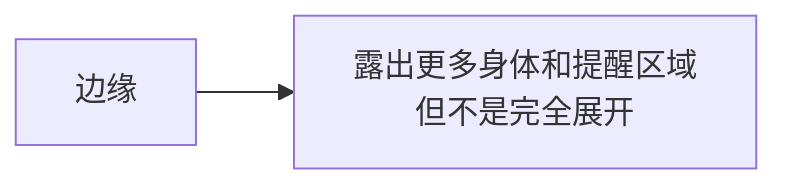

---

## 第一版推荐的具体规则

### 1. 吸附方向

只做：

- 左边缘
- 右边缘

先不做：

- 顶部
- 底部
- 四角吸附

### 2. 吸附触发方式

只允许：

- 用户主动拖动到边缘后松手

不允许：

- 程序自动把它吸去边缘
- 因为收到消息自动吸边

### 3. 半隐藏深度

建议第一版参数：

- 猫本体宽度 180 时，露出 `16px ~ 24px`

建议从 `20px` 开始试。

### 4. 探出深度

建议第一版参数：

- 在半隐藏基础上，再额外探出 `48px ~ 72px`

建议从 `60px` 开始试。

### 5. 自动缩回延迟

建议：

- 鼠标离开后 `300ms ~ 500ms`

建议从 `400ms` 开始试。

### 6. 吸附判定阈值

建议：

- 松手时距离左右边缘 `24px` 内，就吸附

---

## 和现有动画状态结合后的行为规则

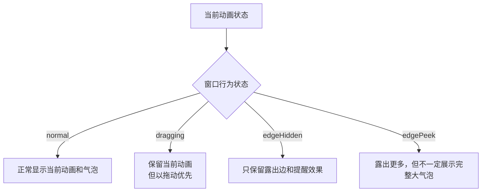

### 具体约束

#### `EnterInput`

- 可以拖动
- 但一旦进入 `edgeHidden*`，建议自动取消输入焦点
- 第一版建议隐藏时不保留输入框可交互状态

#### `working`

- 可以被隐藏
- 隐藏期间不显示完整 working 气泡
- 改成“边缘提醒”

#### `Response`

- 可以被隐藏
- 隐藏期间不显示完整 response 大气泡
- 改成“有新回复”的提醒
- 用户 hover 探出或重新展开后，再看完整内容

#### `shock`

- 可以保留
- 但它是短时动画，不需要单独为隐藏态定复杂逻辑

---

## 为什么隐藏时不直接显示完整 Response 气泡

因为你现在 `Response` 模式窗口尺寸明显更大，直接在隐藏态还保留完整气泡，会出现几个问题：

- 视觉上不像“藏边”，更像“一大片 UI 卡在边上”
- 左右隐藏的表现不对称
- 消息很多时会挤占边缘空间
- 用户把它藏起来的意图会被打断

所以第一版更稳的策略是：

- 隐藏态只做提醒
- 内容展示交给探出态或完全展开态

---

## 多显示器规则

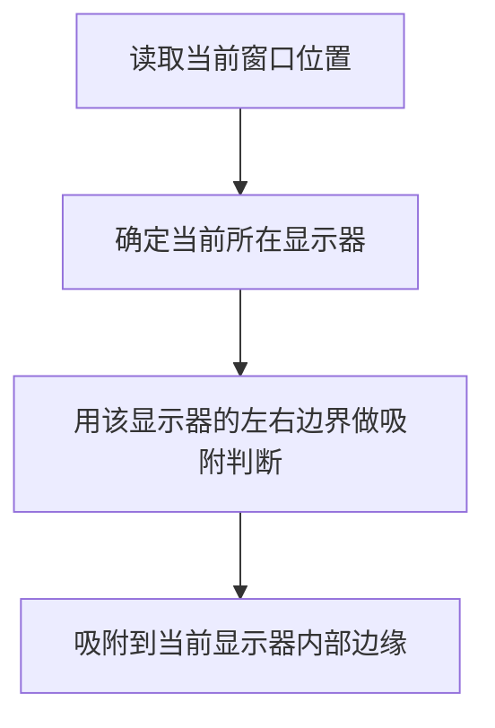

规则：

- 永远以“当前窗口所在显示器”为准
- 不跨屏吸附
- 不从左显示器直接吸到右显示器

---

## 建议的数据结构

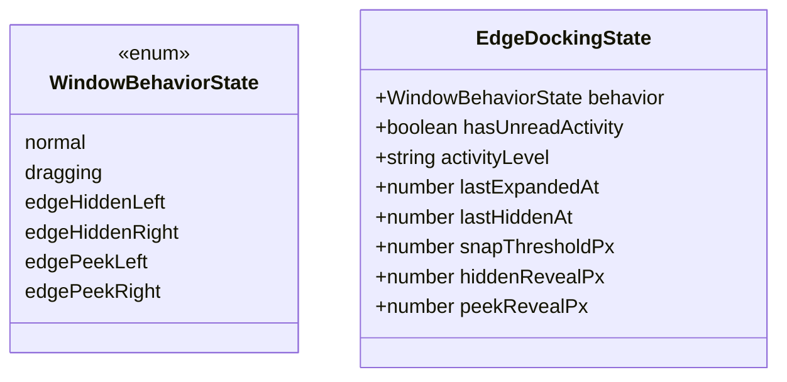

---

## 对实现层的拆分建议

### 前端负责

- 拖动态进入与退出
- 边缘检测
- 鼠标 hover 探出
- 未读提醒的视觉表现
- 和 `DesktopPet.vue` 内现有动画状态结合

### Tauri 窗口 API 负责

- `outerPosition()`
- `setPosition()`
- `currentMonitor()` 或 `monitorFromPoint()`
- `onMoved()`
- `startDragging()`

### Rust 端暂时不需要新增复杂状态机

第一版建议：

- Rust 继续发业务事件
- 贴边隐藏主要在前端完成

这样最贴合你当前项目的结构。

---

## 素材准备清单

这一部分只写“建议准备什么”，不是要求一次做全。

## 第一版最低可用素材

如果想先把功能做起来，最少准备这些：

1. `左右贴边半隐藏静态表现`
   - 不一定要新精灵图
   - 可以先直接复用现有猫图，用窗口裁切实现

2. `边缘提醒小动效`
   - 建议 1 套
   - 用于“working 中”时的轻提醒

3. `新回复提醒动效`
   - 建议 1 套
   - 用于“Response 到来”时的强提醒

第一版最低结论：

- 严格来说，不做新猫动画素材也能先实现
- 只要接受“边缘提醒先用窗口位移 + CSS 发光/轻抖”即可

---

## 如果想做得更好，建议准备哪些动画素材

### A. 拖动态素材

建议：

- `dragging_loop`

用途：

- 用户拖动时，让猫不是普通 idle，而是有“被拎起来 / 被拖走”的感觉

如果暂时没有：

- 第一版可直接沿用当前动画

### B. 贴边藏入素材

建议：

- `hide_into_left`
- `hide_into_right`

用途：

- 松手吸附后，猫有一个“钻进边里”的过渡动作

如果暂时没有：

- 第一版可直接用窗口滑入，不强依赖新素材

### C. 边缘待机素材

建议：

- `edge_idle_left`
- `edge_idle_right`

用途：

- 半隐藏后，露出来的那一点不是纯静止，而是有轻微呼吸

如果暂时没有：

- 第一版可继续露出现有猫图的一部分

### D. 探出素材

建议：

- `peek_left`
- `peek_right`

用途：

- 鼠标移入时，猫有“探头出来看一眼”的感觉

如果暂时没有：

- 第一版用窗口滑出一截即可

### E. 提醒素材

建议：

- `edge_notify_working`
- `edge_notify_response`
- `edge_notify_error`

用途：

- 区分“正在工作”“新回复到了”“报错了”

如果暂时不想做这么细：

- 第一版最少保留两种
  - `working` 轻提醒
  - `response` 强提醒

---

## 动画素材优先级

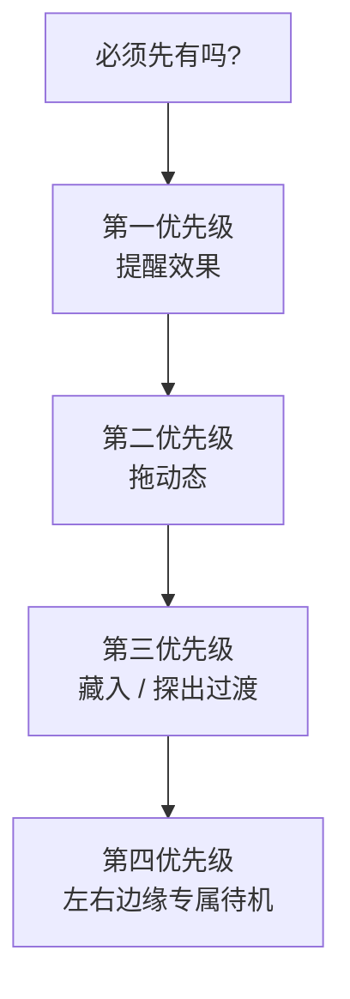

建议优先级排序：

1. `提醒效果`
2. `拖动态`
3. `藏入 / 探出过渡`
4. `左右边缘专属待机`

因为对用户来说，最重要的是：

- 藏起来后还能知道它有反应
- 拖动时交互不突兀

---

## 建议给美术或动画同学的素材需求说明

可以直接按下面这份提：

### 必要说明

- 基础尺寸：按当前桌宠主尺寸 `180 x 180` 设计
- 左右两个方向要分开考虑
- 最终显示区域可能只露出 `20px` 左右
- 所以边缘状态下，关键识别信息要尽量靠近左右边缘

### 素材需求建议清单

- `dragging_loop`
- `hide_into_left`
- `hide_into_right`
- `edge_idle_left`
- `edge_idle_right`
- `peek_left`
- `peek_right`
- `edge_notify_working`
- `edge_notify_response`
- `edge_notify_error`

---

## 第一版最推荐的落地策略

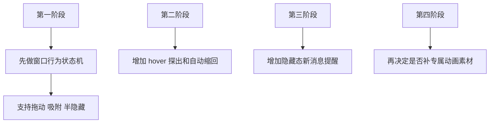

原因：

- 先把交互规则跑通
- 再补视觉精细度
- 不会一开始就被动画素材卡住

---

## 第一版开发时最重要的边界

1. 不要把贴边逻辑并进现有 `AnimState`
2. 不要让隐藏态继续展示完整 Response 大气泡
3. 不要一有新回复就强制完全弹出
4. 不要先做上下边缘
5. 不要为了贴边隐藏去重写现有 Rust 业务状态流

---

## 建议的验收标准

### 交互验收

- 任意动画状态下都能拖动
- 拖到左右边缘松手后能稳定半隐藏
- 鼠标移到露出区域后能探出一点
- 鼠标离开后能稳定缩回
- 半隐藏期间收到 working / response 时能看出提醒

### 稳定性验收

- 不影响现有 `Response` 窗口尺寸同步
- 不影响现有缩放功能
- 不影响多显示器下的边界判断
- 不影响托盘、输入框、文件拖拽等现有能力

---

## 最后的产品判断

这套功能第一版最重要的，不是“藏得多酷”，而是三件事：

1. 用户拖到边缘后，行为符合直觉
2. 藏起来以后，用户仍然知道它有动静
3. 不破坏你现在已经做好的 `working / Response / 缩放 / 锚点` 体系

如果这三点成立，这个功能就已经是可用版本了。

