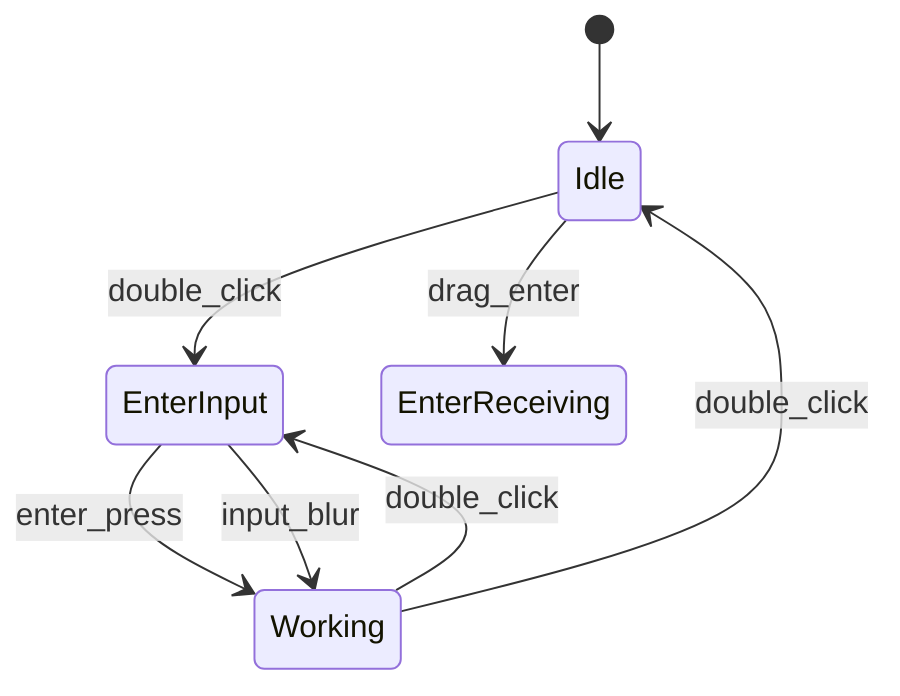

# 状态机设计模式参考

## 概述

状态机（State Machine）是管理离散状态和状态转换的数学模型。广泛应用于：
- 游戏角色行为（NPC、AI）
- UI 交互状态管理
- 协议/通信状态机
- 桌面宠物/桌宠应用的动画状态管理

## 有限状态机 (FSM) vs 状态图 (StateChart)

| 特性 | FSM | StateChart |
|------|-----|------------|
| 状态嵌套 | 扁平 | 支持层级嵌套 |
| 并行状态 | 不支持 | 支持 |
| 历史状态 | 不支持 | 支持 |
| 复杂度 | 简单 | 复杂 |
| 适用场景 | 简单状态流 | 复杂交互逻辑 |

---

## 核心概念

### 状态 (State)

- **初始状态 (Initial)**: 状态机启动时进入的状态
- **最终状态 (Final)**: 状态机结束时的状态
- **Compound State**: 包含子状态的状态

### 转换 (Transition)

- **事件触发 (Event)**: 导致转换的触发条件
- **守卫条件 (Guard)**: 额外的条件判断
- **动作 (Action)**: 转换时执行的副作用

```
┌──────┐    event     ┌──────┐
│StateA│ ──────────▶ │StateB│
└──────┘             └──────┘
     │                    │
     │ on_exit_A          │ on_enter_B
     ▼                    ▼
   [exit]              [enter]
```

### 事件 (Event)

事件可以是：
- 用户输入（点击、拖拽）
- 系统事件（定时器、文件变化）
- 消息/信号

---

## FSM 设计模式

### 经典 FSM 实现（游戏开发）

```rust
// Rust 中的简单 FSM
enum CharacterState {
    Idle,
    Walking,
    Jumping,
    Attacking,
}

struct Character {
    state: CharacterState,
}

impl Character {
    fn handle_input(&mut self, input: Input) {
        match (&self.state, input) {
            (CharacterState::Idle, Input::Move) => {
                self.state = CharacterState::Walking;
            }
            (CharacterState::Idle, Input::Jump) => {
                self.state = CharacterState::Jumping;
            }
            (CharacterState::Walking, Input::Stop) => {
                self.state = CharacterState::Idle;
            }
            (CharacterState::Walking, Input::Jump) => {
                self.state = CharacterState::Jumping;
            }
            // ... 更多转换
            _ => {}
        }
    }
}
```

### Python StateMachine 库示例

```python
from statemachine import StateChart, State

class TrafficLightMachine(StateChart):
    green = State(initial=True)
    yellow = State()
    red = State()

    cycle = (
        green.to(yellow)
        | yellow.to(red)
        | red.to(green)
    )

    def before_cycle(self, event: str, source: State, target: State):
        print(f"Transitioning from {source.id} to {target.id}")
```

### Unity Animator Controller（游戏引擎参考）

Unity 的 Animator Controller 是 FSM 的成熟实现：

- **State**: 每个动画状态
- **Transition**: 状态之间的转换
- **Parameter**: 触发转换的条件变量
- **Blend Tree**: 动画混合

```
┌─────────┐    Idle    ┌─────────┐
│  Idle   │ ◀──────── │ Walking │
│ (动画)   │           │ (动画)   │
└────┬────┘           └────┬────┘
     │                     │
     │ Jump                │ Stop
     │                     │
     ▼                     ▼
┌─────────┐           ┌─────────┐
│ Jumping │           │ Walking │
│ (动画)   │           │ (动画)   │
└─────────┘           └─────────┘
```

---

## 状态图 (StateChart) 进阶特性

### 1. 层级嵌套 (Compound States)

```python
class DocumentWorkflow(StateChart):
    # 顶层状态
    editing = State(initial=True)
    published = State(final=True)
    
    # 嵌套状态
    class editing(State.Compound):
        draft = State(initial=True)
        review = State()
        publish = draft.to(review) | review.to(draft)
    
    submit = editing.to(published)
```

### 2. 并行状态 (Parallel States)

```python
class WarGame(StateChart):
    class battle(State.Parallel):
        class troops(State):
            attacking = State(initial=True)
            defending = State()
            
        class resources(State):
            gathering = State(initial=True)
            spending = State()
    
    end_turn = battle.to(battle)
```

### 3. 历史状态 (History State)

记住退出前的子状态：

```python
class PlayerStates(StateChart):
    class exploring(State):
        class map_view(State):
            h = State(history=True)  # 历史状态
            list_view = State(initial=True)
        
        enter_map = map_view.to(map_view.list_view)
    
    pause = exploring.to(exploring.map_view.h)  # 返回到之前的状态
```

---

## 动画状态机设计最佳实践

### 1. 状态命名规范

```
# 使用行为命名，而非视觉命名
Idle          ✓
LeftIdle      ✗ (太具体)
Waiting       ✓

# 对于过渡状态，使用清晰的语义
EnterWorking  ✓ (进入工作状态)
WorkingLoop   ✓ (工作中循环)
ExitWorking   ✓ (退出工作状态)
```

### 2. 转换规则文档化

```markdown
## 动画状态转换规则

| 当前状态 | 触发条件 | 目标状态 | 备注 |
|---------|---------|---------|------|
| Idle    | 双击    | EnterInput | 打开输入框 |
| Idle    | 拖拽进入 | EnterReceiving | 文件拖拽 |
| Working | 双击    | EnterInput | 保留队列 |
| EnterInput | 按 Enter | Working | 发送消息 |
| EnterInput | 失焦    | Working | 取消输入 |
| * | 右键菜单 | [任意] | 调试切换 |
```

### 3. 分离状态配置与逻辑

```typescript
// 状态配置（数据）
interface StateConfig {
    name: string;
    animation: string;
    duration?: number;
    nextState?: string;
    loop?: boolean;
}

// 状态转换逻辑
class StateMachine {
    private states: Map<string, StateConfig>;
    
    transition(from: string, event: Event): string {
        // 查找有效转换
        // 执行守卫条件
        // 返回目标状态
    }
}
```

---

## 事件驱动 vs 轮询

### 事件驱动（推荐用于状态机）

```typescript
// 事件触发状态转换
element.addEventListener('click', () => {
    stateMachine.send('click');
});

element.addEventListener('dragstart', () => {
    stateMachine.send('dragStart');
});
```

### 轮询（适合 UI 同步）

```typescript
// 定期检查外部状态
setInterval(() => {
    const fileState = readFileState();
    if (fileState !== currentState) {
        stateMachine.send('fileChanged', fileState);
    }
}, 500);
```

---

## 状态机可视化

### 生成状态图

使用 python-statemachine：

```python
from statemachine import StateChart

machine = TrafficLightMachine()
machine._graph().write_png('state_diagram.png')
```

### Mermaid 格式导出



---

## Unity/游戏引擎动画状态机参考

### 1. Mecanim (Unity)

- **Layer**: 动画层级（base layer, upper body overlay）
- **State Machine**: 状态机
- **Blend Tree**: 动画混合
- **Parameter**: 触发条件

### 2. Unreal Animation Blueprint

- **State Machine**: 状态机节点
- **Notify**: 动画事件回调
- **Blend Space**: 多维动画混合

### 3. 通用原则

1. **单入口单出口**: 每个状态应该只从一个状态进入，只到一个状态退出
2. **层次化**: 复杂行为拆分为子状态机
3. **可预测**: 所有转换都应该可追踪和预测
4. **可中断**: 高优先级事件可以中断当前状态

## 8. XState + Vue 集成

XState 是 **StateChart** 的 JavaScript 实现，适合 Vue 项目。

### 安装

```bash
npm install xstate @xstate/vue
```

### 桌面宠物状态机示例

```typescript
import { createMachine } from 'xstate';
import { useMachine } from '@xstate/vue';

const petMachine = createMachine({
    id: 'pet',
    initial: 'idle',
    context: { energy: 100 },
    states: {
        idle: {
            on: { CLICK: 'alert', DBLCLICK: 'input', DRAG: 'dragging' },
        },
        alert: { on: { TIMEOUT: 'idle' }, entry: 'playShock' },
        dragging: { on: { DROP: 'idle' }, entry: 'playDrag' },
        input: { on: { SUBMIT: 'idle', CANCEL: 'idle' } },
    },
});

// Vue 组件中使用
const { snapshot, send } = useMachine(petMachine);
const animName = computed(() => {
    const s = snapshot.value;
    if (s.matches('idle')) return 'idle';
    if (s.matches('alert')) return 'shock';
    if (s.matches('dragging')) return 'drag';
    if (s.matches('input')) return 'input';
    return 'idle';
});
```

---

## 9. 状态转换配置表（模板）

```typescript
// 统一状态转换配置
type Event = 'CLICK' | 'DBLCLICK' | 'DRAG' | 'DROP' | 'TIMEOUT' | 'SUBMIT' | 'CANCEL';

const transitions: Record<AnimState, Array<{ event: Event; to: AnimState }>> = {
    idle: [
        { event: 'CLICK', to: 'alert' },
        { event: 'DBLCLICK', to: 'input' },
        { event: 'DRAG', to: 'dragging' },
    ],
    alert: [{ event: 'TIMEOUT', to: 'idle' }],
    dragging: [{ event: 'DROP', to: 'idle' }],
    input: [
        { event: 'SUBMIT', to: 'working' },
        { event: 'CANCEL', to: 'idle' },
    ],
};
```

---

## 参考资料

- [python-statemachine 文档](https://python-statemachine.readthedocs.io/)
- [游戏设计模式 - 状态模式](https://zhuanlan.zhihu.com/p/22976065)
- [XState 官方文档](https://xstate.js.org/)
- [@xstate/vue](https://github.com/statelyai/xstate/tree/main/packages/xstate-vue)
