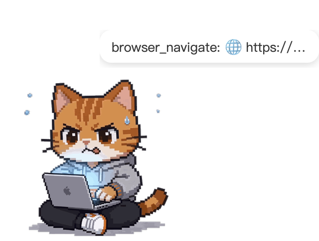
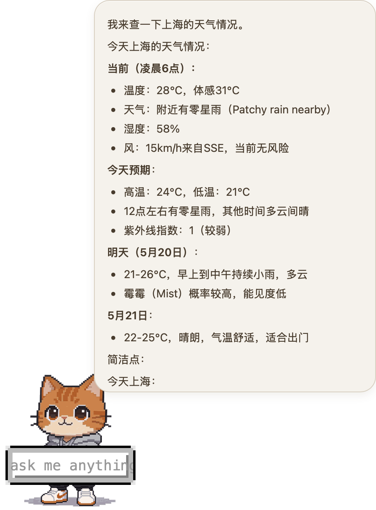
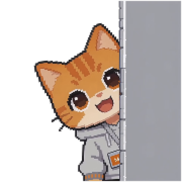
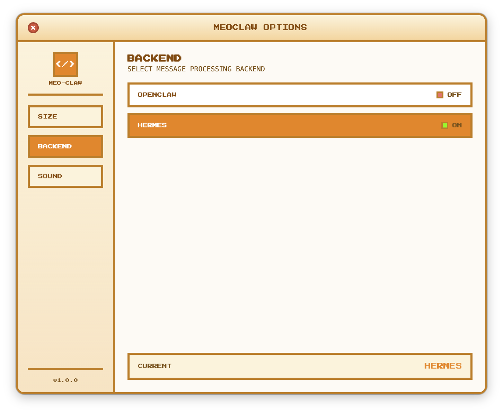

<p align="right">
  <a href="./README.md">English</a> | <strong>中文</strong>
</p>

# MeoClaw 🐾

<div align="center">


**基于 Tauri v2 构建的openclaw/hermes 桌宠助手**

</div>

无需打开终端和网页和任何的第三方channel，直接在桌宠进行和自己配置好的助手对话。

---

## 特性

- **便捷的对话** — 双击桌宠弹出输入框，支持与 AI 后端自然对话
- **文件拖拽处理** — 将文件拖入桌宠窗口，自动识别类型并发送给 AI 处理
- **双后端支持** — 同时兼容 OpenClaw（WebSocket）和 Hermes（HTTP/SSE），运行时自由切换
- **随意拖拽变化** — 位置随意拖动，并支持贴边和大小调节

## 截图展示

| | | |
|:---:|:---:|:---:|
|  |  |  |
| 桌宠待机 | 工具调用气泡 | 文件拖入 |
|  |  |  |
| 回复展示 | 拖拽贴边 | 设置面板 |

## 快速开始

### 环境要求

- Node.js 18+
- Rust 1.70+
- macOS 11+ / Windows 10+ / Ubuntu 20.04+

### 安装与运行

```bash
# 克隆仓库
git clone https://github.com/yourusername/meoclaw.git
cd meoclaw

# 安装依赖
npm install

# 开发模式（前端热更新）
npm run tauri dev

# 构建发布包
npm run tauri build
```

### 运行测试

```bash
npm test
```

## 技术栈

| 层级 | 技术 |
|------|------|
| 前端框架 | Vue 3 + TypeScript（Composition API） |
| 桌面框架 | Tauri v2 |
| 后端语言 | Rust |
| AI 后端 | OpenClaw / Hermes |
| 通信方式 | WebSocket + HTTP/SSE |
| 测试工具 | Vitest + jsdom |

## 交互方式

| 操作 | 功能 |
|------|------|
| 双击 | 弹出输入框，开始 AI 对话 |
| 右键菜单 | 状态切换、后端命令 |
| 长按拖动 | 移动桌宠位置，松手自动贴边 |
| 拖入文件 | 将文件发送给 AI 处理 |
| 托盘左键 | 切换窗口显隐 |
| 托盘右键 | 退出 / 重启 / 设置 |

## 动画状态

| 状态 | 描述 | 播放方式 |
|------|------|----------|
| `idle` | 待机循环 | ping-pong 循环 |
| `shock` | 惊讶 | 单次播放 |
| `EnterInput` | 进入输入模式 | 循环 |
| `startworking` | 开始工作 | 单次 → `working` |
| `working` | 工作循环 | 正向循环 |
| `EnterReceiving` | 进入接收 | 单次 → `Receiving` |
| `Receiving` | 接收循环 | 循环 |
| `received` | 已接收 | 静态单帧 |
| `Response` | 响应展示 | ping-pong 循环 |

**窗口行为动画：** `dragging`（拖拽）、`edgeHiddenLeft/Right`（边缘隐藏）、`edgePeekLeft/Right`（边缘窥视）

## 配置

**后端配置** `~/.local/share/meo-claw/backend-config.json`:

```json
{
  "selected": "openclaw",
  "openclaw": { "endpoint": "ws://127.0.0.1:18789" },
  "hermes": { "endpoint": "http://127.0.0.1:8642" }
}
```

**前端设置**（localStorage）:

| Key | 描述 | 默认值 |
|-----|------|--------|
| `meoclaw.petScale` | 缩放 (0.5~2.0) | 1 |
| `meoclaw.responseSound` | 响应音效 | `chime.mp3` |

## 项目结构

```
MeoClaw/
├── src/                    # Vue 3 前端
│   ├── components/         # 桌宠组件
│   ├── config/             # 动画与图标配置
│   ├── stores/             # 状态管理
│   └── menu/               # 右键菜单
├── src-tauri/              # Rust 后端
│   └── src/
│       ├── backend/        # OpenClaw / Hermes 客户端
│       └── openclaw/       # OpenClaw 协议与认证
├── public/                 # 静态资源（精灵图、音效）
├── DOC/                    # 项目文档
└── package.json
```

## 参与贡献

欢迎通过 Issue 和 Pull Request 参与贡献。请确保提交前通过所有测试：

```bash
npm test
```

## License

Apache 2.0 © 2026 Hue
